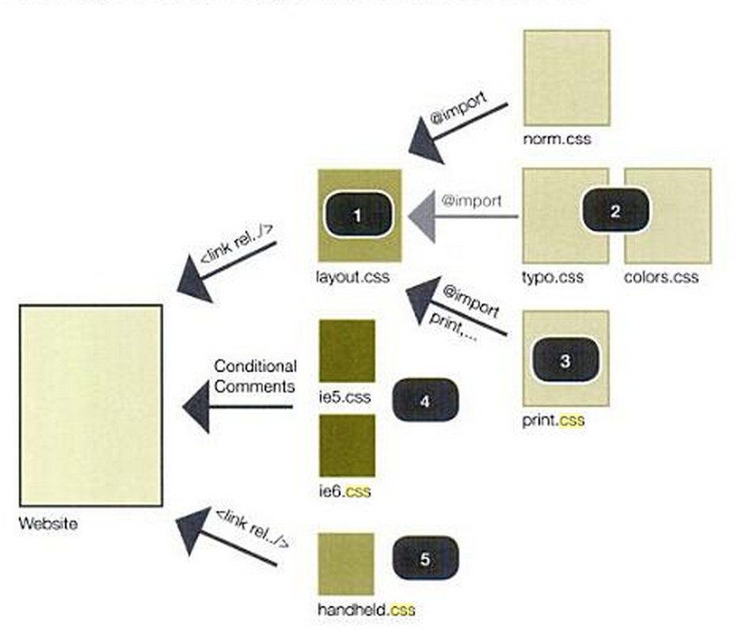
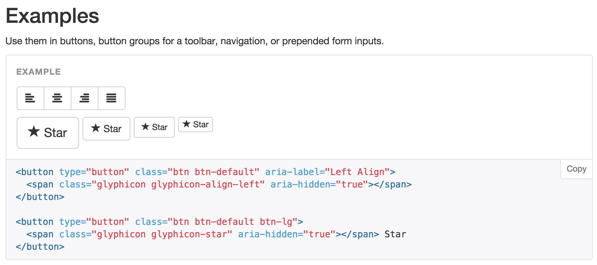
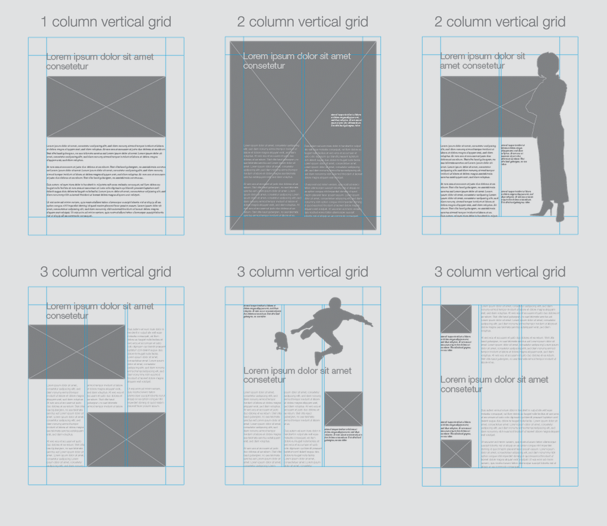
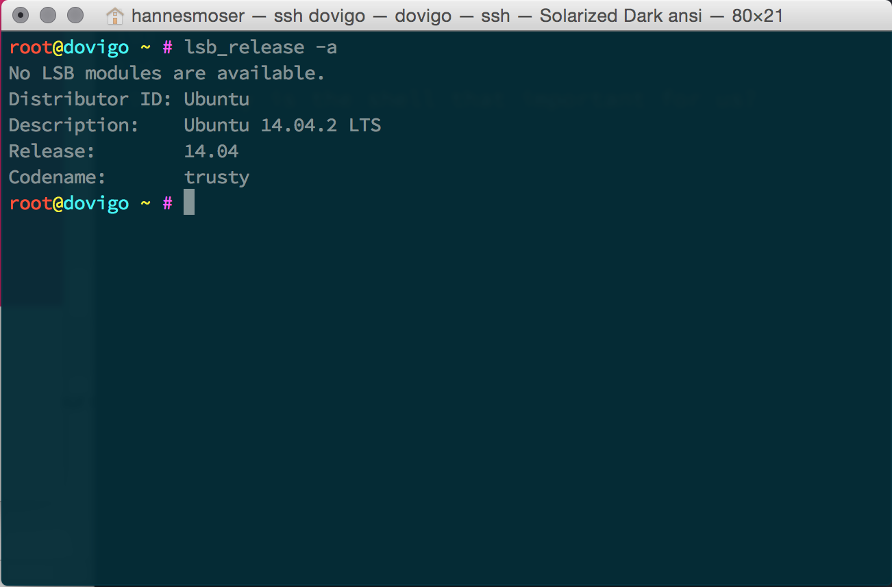
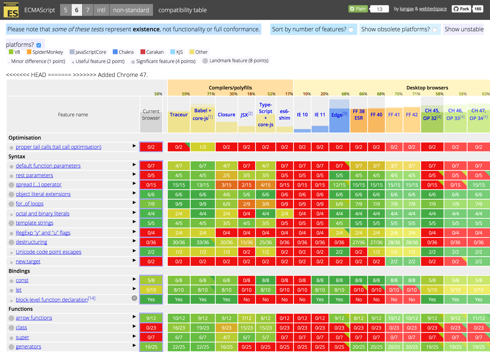

footer: MultiMediaTechnology WS 2015 – Hannes Moser – @eliias 2015
slidenumbers: true
build-lists: true
autoscale: true

# Frontend Development 1
### The *hot shit*<sup>TM</sup>, happens on the frontend!

---

## Goals

- Advanced knowledge of Frontend Development
	- Tooling (w/ *Web Production Workflows*)
	- ECMAScript 2015 (biggest part)
	- HTML5 (recap)
	- CSS3 (+SASS → part of tooling but also structured work)
- Concept and implementation of a frontend for a web application

---

## Exam Procedure And Grades

There will be continuous assessment throughout the course. The final grade will consist of:

- homework: 40%
- oral exams: 25%
- final exam (last scheduled course date): 35%

Each of these three parts must be passed separately.

---

## Documents

- You can use these slides to learn, but…
- referenced articles and book chapters will be part of **the exams**!

# Read the articles and book chapters!

---

## Others

- Strong intersection with *Web Production workflows*
- You might get emails such as this one: "Install Node.js on your laptop"
	- Preparation for the course is mandatory!

---

# Style

---

## What we have done so far

```css
body {
	background-color: white;
}

body a {
	color: red;
}
```

followed by another ~~250~~ 1k lines of code.

---

## Organize Stylesheets

---

## Organize Stylesheets[^CSS Pur!]



[^CSS Pur!]: CSS Pur!, Betinna K. Lechner, Bernhard Stockmann 2010

---

## Organize Stylesheets

- Use `@import`
- Use a convention (BEM, Atomic CSS)
- `Concat` files
- Use a preprocessor (SASS, LESS, …)

---

## Organize Stylesheets
### The `@import` statement

- The specification for the `@import` [rule](http://www.w3.org/TR/css-cascade-3/#at-import)

```
@import [ <url> | <string> ] <media-query-list>? ;
```

```css
@import "mystyle.css";
@import url("mystyle.css");
```
[^CSS Cascading and Inheritance Level 3]

[^CSS Cascading and Inheritance Level 3]: http://www.w3.org/TR/css-cascade-3/#at-import

---

## Organize Stylesheets
### The `@import` statement

**Advantages**
- Standard
- Works for every browser
- Easy to understand

**Problems**
- Multiple Requests

---

## Organize Stylesheets
### The `@import` statement

**Use case:** Import 3rd party styles and webfonts.

```css
@import url(https://fonts.googleapis.com/css?family=Open+Sans);
```

```css
body {
	font-family: 'Open Sans', sans-serif;
}
```

---

## Organize Stylesheets
### Conventions

Use a convention or define one yourself.

- BEM (Block-Element-Modifier)
- Atomic CSS
- OOCSS

---

## Organize Stylesheets
### The `BEM`[^BEM] convention

```css
.header__form--email {}
```

- No `ID`, `class` only
- Separator rules:
	- "`__`" 2 *underscores* between a `block` and an `element`
	- "`--`" 2 *dashes* between `element` and `modifier`

[^BEM]: https://en.bem.info

---

## Organize Stylesheets
### The `BEM` convention

- Blocks are `containers`
- Blocks contain `elements`
- Your classes always start with blockname [^An introduction to the BEM methodology]


[^An introduction to the BEM methodology]: [http://webdesign.tutsplus.com/articles/an-introduction-to-the-bem-methodology--cms-19403](http://webdesign.tutsplus.com/articles/an-introduction-to-the-bem-methodology--cms-19403)

---

## Organize Stylesheets
### The `BEM` convention

**Example** [^CSSWizardy: MindBEMding – getting your head ’round BEM syntax]

```scss
.site-logo {
	background: url("images/logo.png");
}
.site-logo--xmas {
	background: url("images/logo-xmas.png");
}
```
[^CSSWizardy: MindBEMding – getting your head ’round BEM syntax]: [http://csswizardry.com/2013/01/mindbemding-getting-your-head-round-bem-syntax/](http://csswizardry.com/2013/01/mindbemding-getting-your-head-round-bem-syntax/)

---

## Organize Stylesheets
### The `BEM` convention

> The reason for double rather than single hyphens and underscores is so that your block itself can be hyphen delimited…
-- [Harry Roberts](http://csswizardry.com/)

---

## Organize Stylesheets
### Atomic CSS


---

## Organize Stylesheets
### Atomic CSS

- It is more a methodology than a convention
- It is based on 5 levels
  - Atoms
  - Molecules
  - Organisms
  - Templates
  - Pages

---

## Organize Stylesheets
### Atomic CSS

**Atoms**

```html
<label>
<input>
<form>
```

---

## Atom


---

## Organize Stylesheets
### Atomic CSS

**Molecules**
`Molecules` are groups of `atoms`.

```html
<div class="molecule">
  <input class="atom">
</div>
```

---

## Molecule


---

## Organize Stylesheets
### Atomic CSS

**Organisms**
`Organisms` are groups of `molecules`.

```html
<div class="organism">
  <div class="molecule">
  <div class="molecule">
  <div class="molecule">
</div>
```

---

## Organism


---

## Organize Stylesheets
### Atomic CSS

**Templates**
`Templates` are mostly groups of `organisms`.

---

## Template


---

## Organize Stylesheets
### Atomic CSS

**Pages**
`Pages` are concrete instances of `Templates`.

---

## Page


---

## Organize Stylesheets
### OOCSS

> As with any object-based coding method, the purpose of OOCSS is to encourage code reuse and, ultimately, faster and more efficient stylesheets that are easier to add to and maintain.
-- Louis Lazaris [^An Introduction To Object Oriented CSS (OOCSS)]

[^An Introduction To Object Oriented CSS (OOCSS)]: [http://www.smashingmagazine.com/2011/12/an-introduction-to-object-oriented-css-oocss/](http://www.smashingmagazine.com/2011/12/an-introduction-to-object-oriented-css-oocss/)

---

## Organize Stylesheets
### OOCSS[^Bootstrap]



[^Bootstrap]: [http://getbootstrap.com/components/](http://getbootstrap.com/components/)

---

## Organize Stylesheets
### OOCSS

**Resources**
- http://de.slideshare.net/DanOlsavsky/oocss-20284331
- http://oocss.org/
- https://smacss.com/

---

## Organize Stylesheets
### Preprocessors

- SASS
- LESS
- Stylus
- postcss

---

## Organize Stylesheets
### SASS - Variables

```scss
$font-family: 'Helvetica Neue', Verdana, sans-serif;
$brand: red;
```

---

## Organize Stylesheets
### SASS - Nesting

```scss
nav {
  ul {
    li {
      …
    }
  }
}
```

---

## Organize Stylesheets
### SASS - Nesting w/ ampersand

```scss
a {
  color: red;
  &:hover {
    color: blue;
  }
}
```

---

## Organize Stylesheets
### SASS - Nesting w/ ampersand

```css
a {
  color: red;
}
a:hover {
  color: blue;
}
```

---

## Organize Stylesheets
### SASS - Import

```scss
@import "your_sass_partial"
```

```scss
@import "your_sass_partial.css"
```

---

## Organize Stylesheets
### SASS - Import

```scss
@import "_your_sass_partial"
```

**ATTENTION:** By convention, all files starting with `_` are not compiled to
an own `.css` file. Use this for partials.

---

## Organize Stylesheets
### SASS - Mixins

```scss
@mixin border-radius($radius) {
  -webkit-border-radius: $radius;
     -moz-border-radius: $radius;
      -ms-border-radius: $radius;
          border-radius: $radius;
}
```

```scss
.box { @include border-radius(10px); }
```

---

## Organize Stylesheets
### SASS - Extend/Inheritance

```scss
.message {
  border: 1px solid #ccc;
  padding: 10px;
  color: #333;
}

.success {
  @extend .message;
  border-color: green;
}
```

---

## Organize Stylesheets
### SASS - Operators

```scss
div {
  width: 600px / 960px * 100%;
}
```

---

## Organize Stylesheets
### SASS - Functions

```scss
a {
  color: $primary;

  &:hover {
    color: darker($primary, 20%);
  }
}
```

[SASS Functions](http://sass-lang.com/documentation/Sass/Script/Functions.html)

---

# Grid

---

## Grid

Grids did exist long before they have been used as layout tool for websites. [^Grid (graphic design)]


[^Grid (graphic design)]: [https://en.wikipedia.org/wiki/Grid_(graphic_design)](https://en.wikipedia.org/wiki/Grid_(graphic_design))

---

## Grid
### The vertical grid

> Always start your ~~design~~ project with a layout grid. No exceptions.
-- DI* [^DI*]



[^DI*]: [DESIGNERS INSIGHTS](http://www.designersinsights.com/designer-resources/using-layout-grids-effectively)

---

## Grid
### Bootstrap

```html
<div class="row">
  <div class="col-sm-1">
  <div class="col-sm-11">
</div>
```

```html
<div class="row">
  <div class="col-sm-6">
  <div class="col-sm-6">
</div>
```

---

## Grid
### Bootstrap

```html
<div class="row">
  <div class="col-md-3 col-sm-6 col-xs-12">
  <div class="col-md-3 col-sm-6 col-xs-12">
  <div class="col-md-3 col-sm-6 col-xs-12">
  <div class="col-md-3 col-sm-6 col-xs-12">
</div>
```

---

## Grid
### Bootstrap

```html
<div class="row">
  <div class="col-md-3 col-sm-6 col-xs-12">
  <div class="col-md-3 col-sm-6 col-xs-12">
  <div class="col-md-3 col-sm-6 col-xs-12">
  <div class="col-md-3 col-sm-6 col-xs-12">
</div>
```

---

## Grid
### Flexbox Grid

The next generation web layout tool.

[Find it here](http://flexboxgrid.com/)

---

## Grid
### Flexbox

```scss
.container {
  display: flex;
}
```

[A Complete Guide to Flexbox](https://css-tricks.com/snippets/css/a-guide-to-flexbox/)
[Flexbox at MDN](https://developer.mozilla.org/en-US/docs/Web/CSS/CSS_Flexible_Box_Layout/Using_CSS_flexible_boxes)

---

# People And Blogs
## …you probably should have heared of

- Lea Verou: http://lea.verou.me/
- Sara Soueidan: http://sarasoueidan.com/
- Harry Roberts: http://csswizardry.com/

---

# CLI 101

---



---

# Why is the CLI so important for us?

---

## It is the ONLY interface for a lot of tasks!

---

# Common CLI tasks

- Login to servers
- Build tools
- Set file and directory permissions
- Install packages

---

# Important commands

---

## man → __manual__

---

## man man → __opens the man manual__

---

## man ls → __opens the ls manual__

---

## cd → __change directory__

---

## cd .. → __goto parent dir__

---

## cd . → __goto current dir__

---

## cd ./sub → __goto subdirectory__

---

## cd ../sibling <br>→ __goto parent and switch to sibling__

---

## cd ../../ → __go 2 steps up__

---

## pwd → __print name of working directory__

---

## pwd → */var/www/html*

---

## ls → __list__

---

## ls -l → __list in long format__

---

## ls -a → __include hidden files and dirs__

---

## ls -la → __combine flags__

---

## rm → __remove files or directories__

---

## rm -r <br>→ __remove directories and their contents recursively__

---

## rm -f <br>→ __ignore nonexistent files and arguments, never prompt__

---

## chown → __change ownership__

---

## chown www-data:www-data <br>→ __group and user__

---

## chown www-data → __change user only__

---

## chown :www-data <br>→ __change group only__

---

## chown www-data: → __change both__

---

## chmod → __change file mode__

---

## chmod 777 file → __octal-mode__

---

## chmod a+x file → __symbolic-mode__

---

## chmod ugo-rwx file → __reset everything__

---

## tail → __output the last part__

---

## tail file → __output the last part of file__

---

## tail -f file <br>→ __output the last part of file and follow__

---

## exit <br>→ __cause normal process termination__

---

## exit <br>→ __close your terminal session__

---

## Ctrl+c → __kill process with SIGINT__

---

## Ctrl+z <br>→ __suspend process with SIGSTOP__

---

## fg <br>→ __bring suspended process back to foreground__

---

## bg <br>→ __run process in background__

---

## jobs <br>→ __list suspended commands__

---

## kill %1 <br>→ __kill command by index__

---

## clear → __clear the terminal screen__

---

## vi → __start vi editor__

---

## vim → __start vim editor__

---

## nano → __start nano editor__

---

## pico → __start pico editor__

---

## which → __locate a command__

---

## which node <br>→ */usr/local/nvm/versions/io.js/v1.7.1/bin/node*

---

### service <br>→ __run a System V init script__

---

# Package Manager

We are going to use `npm` a lot, but there is more than one.

- [npm](https://www.npmjs.com/)
- [bower](http://bower.io/)
- [jspm](http://jspm.io/)

---

## Install

- You need Node.js. Use [`nvm`](https://github.com/creationix/nvm) to install it.
- `npm` comes with Node.js

---

**Install your first dependency**

```bash
npm install -g eslint
```


---

## ECMAScript 2015

ECMAScript is a language specification (no implementation). ECMA-262 6<sup>th</sup> is the latest edition but there are already drafts for ES7. You might have heard of it as ES6, ES Next or Harmony.

It does not guarantee you, that JavaScript works the same on all platforms (browsers and standalone runtimes → Node.js).

---


---

## ECMAScript Compatiblity Table [^ECMAScript Compatibility]



[^ECMAScript Compatibility]: ECMAScript compatibility table 2015, http://kangax.github.io/compat-table/es6/

---

## Helpful ECMAScript resources

- [caniuse](http://caniuse.com/)
- [Specification](http://www.ecma-international.org/ecma-262/6.0/)
- [Learn ES2015](https://babeljs.io/docs/learn-es2015/)
- [Blog about ES2015](http://www.2ality.com/)
- [ES Compatibility Table](http://kangax.github.io/compat-table/es6/)

---

## Use it today

- [Compiler/Transpiler (Babel)](https://babeljs.io)
- [Browserify](http://browserify.org/)
- [Modern Browsers](http://browsehappy.com/)
- [Node.js](https://nodejs.org)
- [npm](https://www.npmjs.com/)

---

## Toolchain

The toolchain to write modern JavaScript, can get complex.

We will deal with these issues in *Web Prodcution Workflows*.

---

## Code says more than words

**Yay, constants!**

```js
const foo = 'bar'
```

**And let?**

```js
let foo = 'bar'
foo = 'another bar'
```

---

## JavaScript now has block-scoped binding constructs[^MDN 2015]

```js
{
	// Hi, I am block
}

if (true) {
	// Another block
}
```

[^MDN 2015]: MDN 2015, https://developer.mozilla.org/en/docs/Web/JavaScript/Reference/Statements/let

---

## No more `var`?

```js
if (true) {
	var foo = 'bar'
}

// is interpreted as

var foo
if (true) {
	foo = 'bar'
}
```

Your `var` gets hoisted on top of the closest function scope (or top of the file).

---

## How `let` and `const` works

```js
if (true) {
	let foo = 'bar'
}
console.log(foo) // undefined
```

It just lives inside the block.

---

## What's the special sauce of `const`

```js
const foo = 'bar'
foo = 'lalaland'
// SyntaxError: invalid assignment to const foo
```

You cannot reassign to an exsiting `const`.

But…

---

## The "But" in `const`

```js
const a = [1, 2, 3]

a.push(4)

console.log(a) // Array [ 1, 2, 3, 4 ]
```

This works, cause you do not assign anything new to `a`.
You just manipulate the existing `Array`.

---

## Summary

- Blocked scope binding as you would have expect it in the first place
- `const` and `let` is the new `var`

---

## APIs

---

## APIs

```js
const a = [1, 2, 3]
a.includes(1) // true
a.includes(4) // false

const foo = 'bar'
foo.includes('a') // true
foo.includes('d') // false
```

---

## Object Literals

---

## Object Literals

```js
let i = 1
function next() {
  …
}
const o = {
  i,
  next
}
```

---

## Object Literals

```js
const variable = 'test'
const o = {
  [variable]: 1,
  next() {
    …
  }
}
o[variable] = 1
```

---

## Destructuring

---

## Symbols

---

## Symbols

```js
const s1 = Symbol('hannes')
const s2 = Symbol('hannes')

const o = {
  [s1]: 1,
  [s2]: 2
}
```

---

## Template Strings


---

## Template Strings

```js
const name = 'Hannes'
const tpl = `My name is ${name}.`

const name = 'Hannes'
const tpl = 'My name is ' + name + '.'
```

---

## Destructuring

```js
// one assignment / line
function defaults(spec) {
  const {a=1} = spec
  const {b=2} = spec
}
```

---

## Default, ...rest & ...spread

---

## Default, ...rest & ...spread

```js
function f(x = 12) {
  return x
}

f(1) // 1
f() // 12
```

---

## Default, ...rest & ...spread

```js
function f(...x) {
  return x.length
}

f(1, 2, 3) // 3
f(2) // 1
```

---

## Default, ...rest & ...spread

```js
function f(x, y, z = 0) {
  return x + y + z
}

f(...[1, 2]) // 3
f(...[1, 2, 3]) // 6
```

---

## Arrow Functions & Lexical `this`

---

## Arrow Functions & Lexical `this`

```js
method(function(err) {
  …
})
```

```js
method(err => {
  …
})
```

---

## Classes

---

## Classes

```js
class A {
  constructor(a, b) {
    this.a = a
    this.b = b
  }
  sum() {
    return this.a + this.b
  }
}
```

---

## Modules

---

## Modules

* Modular development helps you to structure your projects → Use it everywhere!
* Different implementations for ECMAScript5 compatible languages
  * AMD (Asynchronous Module Definition), e.g. [require.js](http://requirejs.org/)
  * CommonJS, e.g. [Node.js](https://nodejs.org/), [Browserify](http://browserify.org/), [Webpack](http://webpack.github.io/)
* ECMAScript6 hat eigene Spezifikation für Module + Loader[^es6-modules]

[^es6-modules]: [https://babeljs.io/docs/learn-es2015/#modules](https://babeljs.io/docs/learn-es2015/#modules)

---

## Modules
### The need for encapsulation

```
// pseudo namespaces
window.App = {}
window.App.MyApp = {}
```

---

## Modules
### The need for encapsulation

```
(function ($) {
  // add capabilities…

  return my
}(window.jQuery))
```

---

## Modules
### Definition & Loading – AMD

Stands for **Asynchronous Module Definition**[^why-amd].

```js
define(
  ['jquery'],
  function($) {
    // add capabilities…
      return {}
  }
)
```

[^why-amd]: http://requirejs.org/docs/whyamd.html#amd

---

## Modules
### Definition & Loading – CommonJS[^commonjs]

Its origins are on the server, but you can (and should) use it within the browser now.

```js
var $ = require('jquery')

module.exports = {}
```

[^commonjs]: http://www.commonjs.org/

---

## Modules
### Definition & Loading – ES2015

It has become so important, it is now part of the language specification.

```js
import $ from 'jquery'

export default const {}
```

---

## Modules
### Write your own module

```js
// util.js
function pluralize() {
  …
}
export default Object.freeze({
  pluralize
  …
})
```

---

## Modules
### It's about isolation and reusability

```js
// foo.js
String.prototype.trim = function() {
  …
}
```
**THIS IS BAD!**

---

## Modules
### It's about isolation and reusability

```js
// foo.js
function trim(str) {
  return str.trim()
}
export Object.freeze({
  trim
})
```
**THIS IS BAD!**

---

## Modules
### It's about isolation and reusability

```js
// foo.js
function padLeft(str, size = 10) {
  while (str.length < size) str = "0" + str;
  return str
}
export Object.freeze({
  padLeft
})
```

---

## Modules
### How to use

```js
import foo from './foo'

console.log(foo.padLeft('10', 4))
```

---

## Modules
### How to load?

Due to the nature of how browsers work, a synchronous defnition
of imports will not work, right?

- Use `browserify` with transforms (`babelify`)

---

## Modules
### `browserify`

- Use `npm` packages in your browser apps (even `bootstrap`)
- It can do all the fancy stuff for you, `templates`, `uglify`, `transpile`

```bash
browserify dist/app.js -t babelify --outfile dist/app.js
```

---

## Modules
### Assignment

* New directory `02-modules`
* Refactor TODOMVC with `modules`
* New commands to avoid *M$ Windows* build issues
* But first… let's have a look at the code

---

## Iterators + for..of

---

## Iterators + for..of

```js
var alphabet = ['a', 'b', 'c', 'd', …]

for(letter of alphabet) {
  console.log(letter)
}
```

---

## Iterators + for..of[^MDN-Iterators&Generators]

> In JavaScript an iterator is an object that provides a `next()` method which returns the next item in the sequence.
-- MDN

```js
const o = {
  i: 0,
  next: function() {
    this i+= 1
  }
}
```

[^MDN-Iterators&Generators]: https://developer.mozilla.org/de/docs/Web/JavaScript/Guide/Iteratoren_und_Generatoren

---

## Iterators + for..of[^MDN-Iterators&Generators]
### Built-in iterables

**String**, **Array**, **TypedArray**, **Map**, **Set**

---

## Iterators + for..of[^MDN-Iterators&Generators]
### Custom iterables

```js
let o = {}
o[Symbol.iterator] = function* () {
  yield 1
  yield 2
  yield 3
}
for (let val of o) {
  console.log(val) // 1, 2, 3
}
```
---

## Generators

---

## Generators

```js
function* counter(n) {
  var index = 0
  while(index < n) {
    yield index += 1
  }
}

var gen = counter(2)
gen.next().value // 0
gen.next().value // 1
gen.next().value // undefined, gen.next().done === true
```

---

## Promises

---

## Promises[^MDN-Promise]

```js
const promise = new Promise((resolve, reject) => {
  const val = 10
  resolve(val)
})
```
[^MDN-Promise]: https://developer.mozilla.org/de/docs/Web/JavaScript/Reference/Global_Objects/Promise

---

## Promises

```js
promise
  .then(val => {
    console.log(val) // 10
  })
  .catch(err => {
    console.error(err)
  })
```

---

## Promises

```js
db.query(function(err, resultset) {
  if (err) {
    return throw new Error(err.message)
  }
  resultset.forEach(row => {
    row.username = 'hannes moser'
    row.save(function(err, user) {
      if (err) {
        return …
      }
    })
  })
})

db
  .query()
  .then(saveUsername)
  .then(function() {
    return Promise.reject()
  })
  .then(val => {
    console.log(val) // 1
  })
  .catch(err => {

  })
```

---

# Map & Set

---

## Map & Set

```js
const m = new Map()
m.set('key', value)
```

---

## Map & Set

```js
const s = new Set()
m
  .add(1)
  .add(2)
  .add(3)
```

---

## Code Quality

- ESLint
- JSCS

---

# Stylesheets

---

## So what…

- BEM
- Atomic CSS
- Preprocessors
- Grids
- Mediaqueries
- Responsive Layouts

---

# APIs

---

## Authentication

---

# Transition + Animation

---

## Feature Testing & Cross-platform

---

# Non-blocking Programming

---

## Why and how?

```js
const result = fetch('file.bin')
// i am still waiting…

process(result)
```

---

## Continuation-passing Style [^CPS]

[^CPS]: http://matt.might.net/articles/by-example-continuation-passing-style/

---

## Definition

> No procedure is allowed to return to its caller--ever.
-- Matt Might

> Procedures can take a callback to invoke upon their return value.
-- Matt Might

---

## CPS by example

```js
const result = fetch('file.bin')
// i am still waiting…

process(result)

// transforms into

fetch('file.bin', process)
```

---

## CPS the JavaScript/Node.js way

```js
const result = fetch('file.bin', function(err, result) {
	if (err) {
		throw new Error('booooo')
	}
	process(result)
})
```

---

## CPS real world example

```js
app.get('/users', function(req, res, next) {
	req.users.isAuthenticated(function(err, match) {
		if (err) {
			return next(err)
		}
		next(null, match)
	})
})
```
---

## CPS and the “Pyramide of doom”

Things can get ugly pretty quick. This phenomenon is also known as “Callback hell”.

```js
fs.readdir(source, function(err, files) {
  if (err) {
    console.log('Error finding files: ' + err)
  } else {
    files.forEach(function(filename, fileIndex) {
      gm(source + filename).size(function(err, values) {
        if (err) {
          console.log('Error identifying file size: ' + err)
        } else {
          aspect = (values.width / values.height)
          widths.forEach(function(width, widthIndex) {
            height = Math.round(width / aspect)
            this.resize(width, height).write(destination + 'w' + width + '_' + filename, function(err) {
              if (err) console.log('Error writing file: ' + err)
            })
          }.bind(this))
        }
      })
    })
  }
})
```

---

## How to avoid the callback hell

> “Write small modules that each do one thing, and assemble them into other modules that do a bigger thing. You can't get into callback hell if you don't go there.” [^Callback hell]
-- Isaac Schlueter

[^Callback hell]: http://callbackhell.com/

---

# Promises

“The Promise object is used for deferred and asynchronous computations. A Promise represents an operation that hasn't completed yet, but is expected in the future.” [^MDN Promise]

It is available in all ES2015 comaptible implementations.

[^MDN Promise]: https://developer.mozilla.org/en/docs/Web/JavaScript/Reference/Global_Objects/Promise

---

## How to use

- Use builtin Promise object on modern platforms (Node.js/ES2015 in Browsers)
- Use a Promise library → Promises/A+ [^Promises/A+]
	- [**polyfill**](https://github.com/jakearchibald/es6-promise) for everything
	- [**q**](https://github.com/kriskowal/q) for the browser
	- [**bluebird**](https://github.com/petkaantonov/bluebird) for the server

[^Promises/A+]: https://promisesaplus.com/

---

## Example

```js
const foo = Promise.resolve('bar')
foo.then(function(value) {
	console.log(value) // "bar"
})
```

---

**Async HTTP requests**

```js
const foo = fetch('https://hannesmoser.at') // returns Promise
foo.then(function(value) {
	console.log(value) // the HTML of my website
})
```

**Chaining**

```js
read('file')
	.then(process)
	.then(save)
```

---

**Fetch `n` pages**

```js
const pages = [fetch(…), …]
Promise
	.all(pages)
	.then(save)
```

---

# Universal JavaScript

---

# Functional programing [^fp]

- Functions are first-class citizens
- Higher order functions

**ATTENTION!** This is a limited and not 100% correct definition of functional programing. But good enought too start.

[^fp]: https://en.wikipedia.org/wiki/Functional_programming

---

## Example

```js
function pick(a) {
	return function(n) {
	return random(n, a)
		.forEach(function(a) {
			console.log('* ', a, "\n")
		})
	}
}
```

---

# Alternative Script Languages

- CoffeeScript
- TypeScript
- Dart

---

## Libraries

- lodash
- jquery
- modernizr
- react
- handlebars
- immutable

---

# Polyfills

- fetch

---

## Automation

- Creating projects
- Yeoman
- Webpack
- systemjs
- Broccoli

---


---

# Performance Metrics


---

## Hot technologies

- https://assets.thoughtworks.com/assets/technology-radar-may-2015-en.pdf

---


---

# Resources

A growing list of resources: Articles, links, videos, slides that you should have
seen.

---

# Resources
## Interoperable CSS

---


---

# Resources
## CSS Modules

- CSS Modules: https://github.com/css-modules/css-modules
